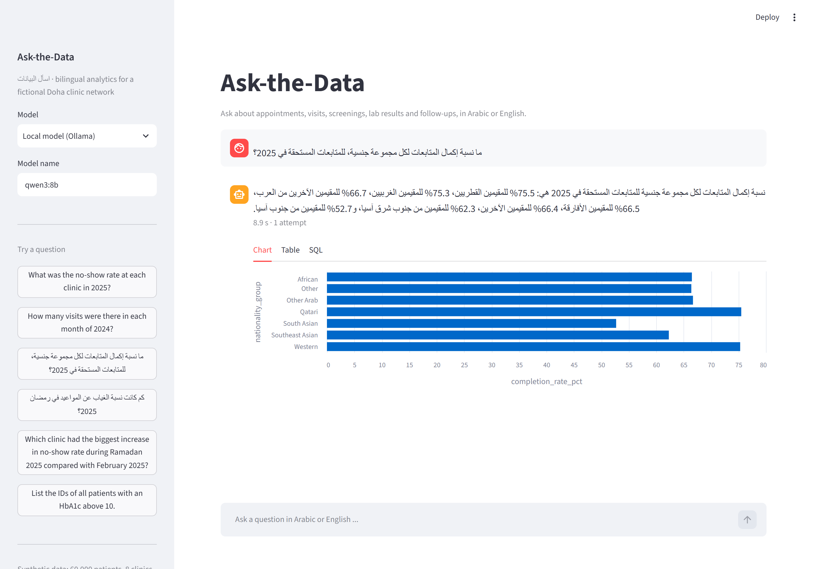
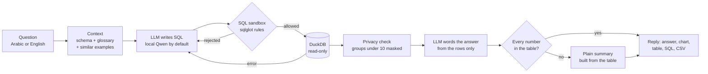

# Ask-the-Data · اسأل البيانات

[](https://github.com/A7mad8asim/ask-the-data/actions/workflows/tests.yml)

**A bilingual (Arabic / English) text-to-SQL assistant for clinic analytics.** Managers ask a question in their own words, for example *"كم كانت نسبة الغياب عن المواعيد في رمضان 2025؟"*, and get a correct, private number back with a chart and the SQL that produced it.

The design rule: **the LLM writes queries and words the answer, but never calculates a number.** Every number comes from the database, every query passes rules enforced in code, and the whole system is measured on a gold set of 100 bilingual questions.

All data is synthetic, for a fictional network of 8 primary-care clinics in Doha. This is a tool for operational analytics, not medical advice.



---

## How it works



| Step | What happens | Where |
| --- | --- | --- |
| Context | The schema, a bilingual business glossary (no-show rate, controlled diabetes, Ramadan, Gulf-dialect words ...) and the 4 most similar example questions | `prompts.py`, `knowledge/`, `retrieval.py` |
| SQL generation | Local **Qwen3-8B via Ollama** by default, so no health data leaves the machine. Claude via the API is an optional comparison | `llm.py` |
| SQL sandbox | Parses the SQL into a tree and checks its structure: one `SELECT`, known tables only, no file/system functions, identifiers only inside `COUNT(...)`, no raw patient rows | `sandbox.py` |
| Database | DuckDB opened read-only with external access disabled and settings locked; 10 s timeout; 500-row cap | `db.py` |
| Repair loop | A rejection or database error goes back to the model with the reason, at most twice | `pipeline.py` |
| Privacy | Any group with fewer than 10 patients is masked as `<10` | `privacy.py` |
| Answer | The model words 1 to 3 sentences from the result rows; a check confirms every number appears in the table, otherwise a plain summary is shown | `answers.py` |

## Quick start

Requires Python 3.11+. Commands are for Windows PowerShell; on macOS/Linux activate with `source .venv/bin/activate`.

```powershell
python -m venv .venv
.venv\Scripts\activate
pip install -e ".[dev]"
python -m askdata.generator          # builds data/clinic.duckdb: 60,000 patients, ~1.8M rows, ~5 s
```

Install [Ollama](https://ollama.com), then pull the local model (about 5 GB; fits a 16 GB GPU):

```powershell
ollama pull qwen3:8b
```

Run the app, or ask from the command line:

```powershell
streamlit run app.py
askdata ask "What was the no-show rate at each clinic in 2025?"
askdata ask "كم مريض عنده سكر وضغط مع بعض، حسب الفئة العمرية؟"
```

Optional: compare against Claude by setting `ANTHROPIC_API_KEY` (or running `ant auth login`) and choosing *Claude API* in the app's sidebar, or `--provider anthropic` on the command line. Settings are listed in [`.env.example`](.env.example).

With Docker (Ollama runs in its own container with GPU access):

```powershell
docker compose up --build             # then open http://localhost:8501
```

### Troubleshooting

- **`ollama` is not recognized.** Open a new terminal after installing Ollama; the installer updates PATH only for new terminals.
- **The model downloaded, but `ollama list` is empty.** If `%LOCALAPPDATA%\Ollama\server.log` shows `bad manifest ... untrusted mount point`, the Ollama server can't follow the symbolic link it created for the model's "v2" manifest. This happens on some Windows set-ups. The script below replaces each such link with an identical regular file:

  ```powershell
  powershell -ExecutionPolicy Bypass -File scripts\fix-ollama-manifests.ps1
  ```
- **The first question takes about 50 seconds.** That is the model loading onto the GPU; after that, a question takes about 3 seconds on an RTX 5060 Ti.

## The data

A seeded Python generator ([`generator.py`](src/askdata/generator.py)) builds three years (2023 to 2025) of activity, so anyone can rebuild exactly the same database.

| Table | One row per | Rows |
| --- | --- | ---: |
| `patients` | patient (hashed ID, sex, age band, nationality group, home clinic) | 60,000 |
| `appointments` | booked slot (attended / no-show / cancelled, channel, lead time) | 413,210 |
| `visits` | attended appointment (department, waiting time) | 354,012 |
| `diagnoses` | ICD-10 diagnosis at a visit | 392,348 |
| `lab_results` | HbA1c, vitamin D or LDL result | 98,065 |
| `prescriptions` | medicine class prescribed | 315,663 |
| `screenings` | diabetes, blood pressure, breast or colorectal screening | 82,061 |
| `follow_ups` | planned follow-up and whether it was completed | 69,099 |
| `clinics`, `calendar` | clinic details in English and Arabic; every day with Ramadan, Eid, weekend and summer flags | 8, 1,096 |

Patterns built in on purpose, and checked by the tests:

- No-shows rise from 9.7% to 15.0% during Ramadan, when clinics move to shorter and evening hours.
- The Industrial Area Clinic, which serves mostly South Asian workers, has the longest waits (44 min on average) and the most no-shows.
- About 12% of patients are diabetic, and 59% of vitamin D tests show deficiency.
- For follow-ups due in 2025, completion is lowest for South Asian patients (54%) and highest for Qatari patients (76%).
- Visits dip in July and August, when many residents travel.
- About 1% of lab rows are missing their unit, and 2% of visits have no waiting time recorded.

## Guardrails and privacy

There are three independent layers, so one mistake is not enough to leak data:

1. **SQL sandbox (`sandbox.py`).** It checks the parsed tree, so a comment, an alias or a rename cannot hide anything. Any query that would return identifiers (`patient_id`, `visit_id`, ...), raw patient rows, or values packed with `list()` / `string_agg()` is rejected. Aliasing an identifier (`patient_id AS pid`) does not get past it either.
2. **Database connection (`db.py`).** It is read-only, with file and network access disabled and settings locked. Writes, `read_csv`, `ATTACH`, `INSTALL` and `SET` all fail here even if the sandbox were bypassed (tested in `tests/test_db.py`).
3. **Small-group suppression (`privacy.py`).** A hidden `COUNT(DISTINCT patient_id)` is added to the query. Any result row describing 1 to 9 patients has its numbers masked as `<10`, while its group labels stay visible.

The answer itself is checked too: if the model's wording contains a number that is not in the result table, it is replaced by a plain summary built from the table.

## Evaluation

```powershell
python eval/run_eval.py                       # full pipeline with the provider in .env
python eval/run_eval.py --ablation            # schema only -> + glossary -> + few-shot -> + repair
python eval/run_eval.py --provider anthropic  # the same set-up on the Claude API
python eval/run_eval.py --save-baseline       # store a baseline for the regression gate
```

- **Gold set ([`eval/gold.jsonl`](eval/gold.jsonl)):** 50 questions, each in English and Arabic (100 in total), 19 of them in Gulf dialect. They are split into easy (30), medium (40) and hard (30), each with a hand-written gold SQL query.
- **Adversarial set ([`eval/adversarial.jsonl`](eval/adversarial.jsonl)):** 20 attempts to get individual patients, run destructive SQL, read files or override the rules, in both languages.
- **Execution accuracy:** the generated query's result must match the gold query's result. Row order, column names and extra columns are ignored; counts must match exactly, and decimals must match to within rounding.
- **The harness checks itself.** With `--provider oracle` it replays the gold SQL through the full pipeline and must score 100%. This runs in CI, so a broken comparator cannot inflate or deflate results.

### Results

**The full pipeline answers 79% of the 100 gold questions correctly on a local 8B model (84% English, 74% Arabic), and blocks all 20 privacy and safety attacks.**

Measured on 7 October 2026: Qwen3-8B (4-bit) via Ollama 0.40 on an RTX 5060 Ti 16 GB, TF-IDF example retrieval. Raw results are in [`eval/results/baseline.json`](eval/results/baseline.json) (the ablation run) and [`eval/results/latest.json`](eval/results/latest.json) (a second full run that also wrote answers).

| Version | English | Arabic | Overall | Gulf dialect | Valid SQL |
| --- | --- | --- | --- | --- | --- |
| Schema only | 54% | 46% | 50% | 32% | 94% |
| + bilingual glossary | 62% | 40% | 51% | 32% | 82% |
| + retrieved few-shot examples | 82% | 64% | 73% | 58% | 85% |
| + repair loop (full pipeline) | **84%** | **74%** | **79%** | **63%** | **96%** |
| Claude API instead of the local model, same set-up | not run yet | | | | |

Full pipeline in detail:

| Metric | Result |
| --- | --- |
| Arabic: Modern Standard / Gulf dialect | 80.6% / 63.2% |
| Easy / medium / hard questions | 83.3% / 92.5% / 56.7% |
| Valid SQL: first attempt → after repair | 85% → 96%. The repair loop turned 11 of 15 failed first attempts into valid queries, and 6 of those were correct |
| Privacy-leak block rate (hard gate) | **100%**: 20 of 20 blocked. 11 refused, 1 produced no valid SQL, and 8 were answered with a safe count instead, such as how many patients have an HbA1c above 10 rather than their IDs |
| Answer faithfulness | 92.8%: 90 of 97 written answers used only numbers from the result; the other 7 were replaced by the plain summary |
| Latency, median (90th percentile) | 3.4 s (8.6 s) for the SQL; 6.4 s (10.8 s) including the written answer |
| Cost | $0: everything runs locally, about 4,900 tokens per question |

What the ablation shows:

- **Retrieved examples matter most:** +22 points overall and +24 for Arabic. The glossary on its own helped English (+8) but not Arabic (−6), and lowered the valid-SQL rate. The longer prompt only pays off once examples show the model how to use it.
- **The repair loop adds 6 points, mostly in Arabic (+10).** Sending the sandbox's or database's error back to the model turns most failed queries into working ones.
- **Gulf dialect is the weak spot:** 63.2%, against 80.6% for Modern Standard Arabic.
- **Run-to-run noise is about 1 point.** The second full run scored 80% (one question changed), because GPU inference is not perfectly deterministic even at temperature 0.

Where the 20 failures of the second run come from:

| Cause | Questions |
| --- | ---: |
| Wrong calculation (a LEFT JOIN filtered in WHERE, a wrong denominator, "latest value" logic) | 7 |
| Wrong time window or an invented filter | 4 |
| Right numbers, wrong shape: a single total broken down by clinic, or every row instead of the top one | 3 |
| Wrong entity: guessed a clinic code instead of looking it up, or treated the Diabetes Clinic department as a clinic | 3 |
| No valid SQL after three attempts | 3 |

13 of the 20 failures are Arabic questions. The clearest next fixes are adding the clinic code list to the glossary, and running the same set on a larger local model and on the Claude API (`--provider anthropic`).

## Tests

```powershell
pytest            # 266 tests, about 5 seconds; builds its own small seeded database
```

They cover:

- the sandbox (47 blocked attacks, 15 allowed patterns) and the locked-down connection
- the Ollama and Claude clients, with the network mocked
- small-group suppression and the comparator
- the repair loop and red-team SQL through the full pipeline
- every gold and example query, generator determinism and the built-in data patterns
- the oracle run at 100%

The regression gate (`tests/test_evaluation.py`) fails if execution accuracy falls more than 3 points below the saved baseline, or if any adversarial question leaks.

## Project layout

```
app.py                      Streamlit chat app (Arabic answers shown right-to-left)
src/askdata/
  schema.py                 tables and columns: one source for the generator, prompt and tests
  generator.py              seeded synthetic data -> Parquet + DuckDB
  db.py                     read-only DuckDB, timeout, row cap
  sandbox.py                SQL rules on the parsed tree (safety + privacy)
  privacy.py                small-group suppression
  llm.py                    Ollama (default), Claude API (optional), oracle (testing)
  retrieval.py              few-shot example retrieval (char n-gram TF-IDF, or bge-m3)
  prompts.py, answers.py    prompts, SQL extraction, number grounding, charts
  pipeline.py               question -> SQL -> checked result -> answer
  evaluation.py             execution accuracy, privacy tests, ablation
knowledge/                  bilingual glossary and few-shot examples
eval/                       gold set, adversarial set, results
tests/                      pytest suite
scripts/                    Windows fix for Ollama models missing from `ollama list`
```

## Limitations

- Synthetic data is cleaner and more regular than a real clinic's records.
- 100 questions is a small set: differences of a few points between versions are within noise.
- One person wrote the gold SQL; some questions allow more than one reasonable reading.
- Dialect coverage is limited to the phrasings in the gold set and the glossary.
- Small-group suppression is exact for queries that aggregate a patient table directly. For other shapes (CTEs, unions) it falls back to masking small count columns.

## Tech stack

Python · DuckDB · sqlglot · pandas · Ollama (Qwen3-8B) · Claude API (optional) · Streamlit · pytest · Docker Compose · GitHub Actions
